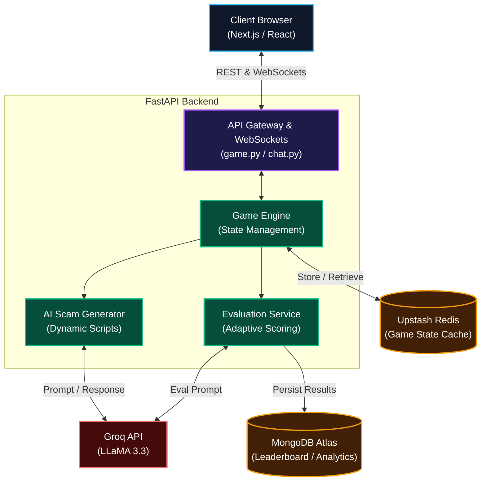

# ScamEscape

ScamEscape is an educational, AI-powered platform designed to teach users how to identify and avoid real-world scams through interactive simulations of phone calls and chat messages.

---

## How to Play

| Round | Scenario | Goal |
|-------|----------|------|
| **1** | Phone call from "bank" | Hang up to escape |
| **2** | WhatsApp messages | Report the scam |

**Scoring:** 70-100 = Escaped | 1-50 = Scammed

---

## Quick Start

**1. Get API Key**  
Create a free account and obtain an API key at [https://console.groq.com](https://console.groq.com)

**2. Backend (Windows)**
```powershell
cd backend
python -m venv venv
.\venv\Scripts\Activate.ps1
pip install -r requirements.txt
# Create .env: GROQ_API_KEY=your-key
python -m uvicorn app.main:app --reload
```

**3. Frontend (new terminal)**
```bash
cd frontend
npm install
npm run dev
```

**4. Play:** Navigate to http://localhost:3000

---

## Requirements

| Requirement | Version | Purpose |
|-------------|---------|---------|
| **Python** | 3.13+ | Runs the backend |
| **Node.js** | 18+ | Runs the frontend |
| **Groq API Key** | Free | Powers AI scammer |
| **RAM** | 4GB+ | Smooth performance |
| **Browser** | Modern | Play the game |

---

## Environment Files

**Backend .env:**
```env
GROQ_API_KEY=your-key-here
GROQ_BASE_URL=https://api.groq.com/openai/v1
```

**Frontend .env.local:**
```env
NEXT_PUBLIC_API_URL=http://localhost:8000
```

---

## Common Issues

| Issue | Fix |
|---------|--------|
| API Key error | Check `.env` file |
| Backend won't start | Restart Python |
| "Failed to fetch" | Ensure backend is running on port 8000 |
| Black screen frontend | Check frontend terminal for errors |
| CORS errors | Verify `FRONTEND_ORIGIN` in backend |

---

## Documentation

- [Full Setup Guide](SETUP.md)
- [API Docs](API_DOCS.md)

---

## Contribute

1. Fork the repository
2. Implement your changes
3. Submit a Pull Request

---

## Features

### Round 1: Phone Call Simulation
- **AI-Generated Scam Calls**: Realistic phone conversations with adaptive difficulty.
- **Multiple Scammer Types**: Bank agents, delivery scams, government impersonators, tech support frauds.
- **Real-time Decision Making**: Multiple response options to choose from.
- **Red Flag Detection**: Learn to spot suspicious patterns.
- **Time Pressure**: Experience realistic urgency tactics.
- **Score Tracking**: Instant feedback on performance.

### Round 2: WhatsApp Chat
- **Two-Way AI Conversations**: Dynamic message exchanges with an AI scammer.
- **Authentic UI**: Real WhatsApp-like experience.
- **Multiple Tactics**: Urgency, authority, social engineering.
- **Scam Detection**: Report suspicious messages and escape.
- **Behavior Analytics**: Track your responses and patterns.

### Smart Features
- **Adaptive Difficulty**: Game learns from your behavior.
- **Psychological Analysis**: Vulnerability assessment for learning.
- **Educational Insights**: Learn why scams work.
- **Multiple Difficulty Levels**: Easy, Medium, Hard modes.

---

## Technology Stack

### System Architecture



### Backend
| Tech | Version | Purpose |
|------|---------|---------|
| **FastAPI** | 0.115+ | High-performance async framework |
| **Python** | 3.13+ | Backend logic & AI integration |
| **Groq LLaMA** | 3.3 | AI-powered scammer generation |
| **MongoDB** | 6.x | Data persistence & storage |
| **WebSockets** | Native | Real-time communication |

### Frontend
| Tech | Version | Purpose |
|------|---------|---------|
| **Next.js** | 16.2+ | React meta-framework |
| **React** | 19.2+ | UI components & library |
| **TypeScript** | 5.x | Type-safe JavaScript |
| **Tailwind CSS** | 4.x+ | Responsive styling |
| **Framer Motion** | Latest | Smooth animations |

### Tools & Services
| Component | Technology |
|-----------|-----------|
| **Authentication** | JWT Tokens |
| **Analytics** | Custom Engine |
| **Testing** | Pytest / Jest |
| **Documentation** | Auto-generated |
| **Deployment** | Docker Ready |

---

## Project Structure

```
ScamEscape/
├── backend/
│   ├── app/
│   │   ├── main.py                 # FastAPI entry
│   │   ├── api/
│   │   │   ├── game.py             # Game endpoints
│   │   │   ├── chat.py             # Chat endpoints
│   │   │   └── room.py             # Room management
│   │   ├── services/               # Core services
│   │   │   ├── ai_scam_generator.py
│   │   │   ├── game_engine.py
│   │   │   ├── scoring.py
│   │   │   └── ...
│   │   └── models/                 # Data models
│   └── requirements.txt
│
├── frontend/
│   ├── app/
│   │   ├── page.tsx                # Home
│   │   ├── layout.tsx              # Layout
│   │   └── simulation/             # Game pages
│   ├── components/
│   │   ├── layout/                 # Navigation
│   │   ├── sections/               # Game screens
│   │   └── ui/                     # UI components
│   ├── hooks/                      # React custom hooks
│   └── lib/                        # Utilities
│
└── README.md
```

---

## Scoring System

| Score Range | Result | Meaning |
|------------|--------|---------|
| 70-100 | **ESCAPED** | Successfully avoided scam |
| 50-69 | **WARNING** | Risky decisions made |
| 1-49 | **SCAMMED** | Fell for the scam |

---

## Use Cases

**For Individuals**
- Learn to protect yourself from scams
- Understand psychological manipulation
- Practice real-world scenarios safely

**For Organizations**
- Train employees on fraud prevention
- Create awareness programs
- Test security awareness levels

**For Educators**
- Teach cybersecurity basics
- Engage students with interactive learning
- Provide real-world threat education

---

## Learning Path

1. **Beginner** - Start with Easy mode
2. **Intermediate** - Try Medium difficulty
3. **Expert** - Challenge yourself with Hard mode
4. **Mastery** - Teach others using ScamEscape

---

## Security & Privacy

- No personal data stored
- No account creation required
- Open source code

---

## Support & Contact

- **Issues**: Report bugs via GitHub Issues
- **Suggestions**: Share ideas in Discussions
- **Email**: [Contact Team](mailto:support@scamescape.dev)
- **Documentation**: Full guides in SETUP.md and API_DOCS.md

---

## License

MIT License - Free to use and modify

---

## Team Members

- Taksh Gandhi
- Saniya Parmar
- Felista Periera
- Rishabh Tripathi

---

## Roadmap

- [ ] Mobile app (iOS & Android)
- [ ] Multiplayer competitive mode
- [ ] Advanced analytics dashboard
- [ ] Custom scenario creator
- [ ] Video call scam simulation
- [ ] International language support

---

Developed by the ScamEscape Team
